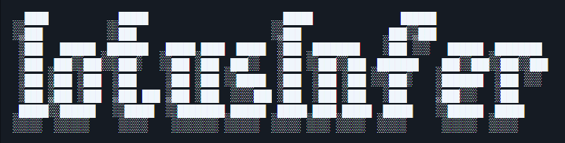
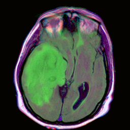
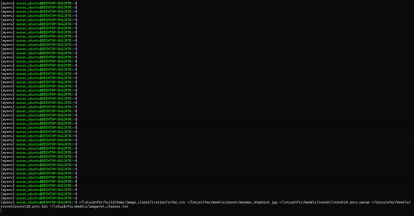

## Overview

lotusInfer is a lite-weight deep learning inference framework, supporting CUDA accleration. The framework includes implemented CUDA operators like 2D-convolution, matrix-vector multiplication and pooling, with ongoing development of additional operators such as transformer. The long-term goal is to make this framework powerful enough to support forefront Large Language Model (LLM) inference.


## Main Features
- **Pure CUDA**: Operators are developed entirely from scratch, with no dependency on cuBLAS or cuDNN
- **Outstanding Performance**: Optimizations are implemented to greatly exploit GPU architecture
- **Operator Fusion**: Activation and addition are fused into preceding operator to improve computation/memory accessing ratio
- **High Clarity**: The graph is constructed in a straightforward and clear manner


## Development Environment and Libraries Used
- **Operating System**: WSL Ubuntu 22.04.4 
- **C++ Standard**: C++20
- **CUDA Compute Capability**: 8.6 or above
- **PyTorch Neural Network Model Format**: [PNNX](https://github.com/Tencent/ncnn/tree/master/tools/pnnx)
- **Multi-dimensional Array Library**: [xtensor3](https://xtensor.readthedocs.io/en/latest/)
- **Log Library**: [spdlog](https://github.com/gabime/spdlog)
- **Image Processing Library**: OpenCV


## Install
```bash
$ git clone https://github.com/skystriker1997/lotusInfer.git
$ cd lotusInfer && mkdir build && cd build
$ cmake .. && make -j
```

## U-Net Demo
  
source of image: [mateuszbuda/brain-segmentation-pytorch](https://github.com/mateuszbuda/brain-segmentation-pytorch/raw/master/assets/TCGA_CS_4944.png)  
On my device, lotusInfer takes only 0.66 seconds to execute the U-Net model and correctly figure out the abnormal area as below  


## resnet18 Demo
 
On my device, lotusInfer takes only 0.66 seconds to execute the resnet18 model and correctly classify the object as a German shepherd
 

## TO-DO List
1. Implement transformer to support LLM


